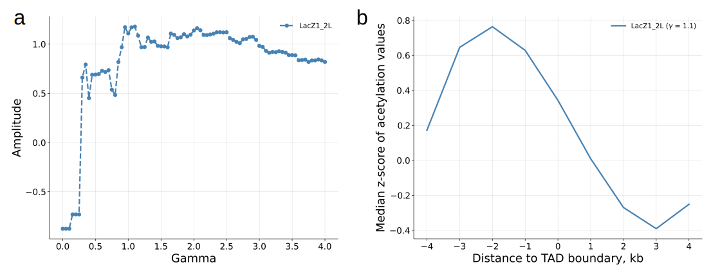
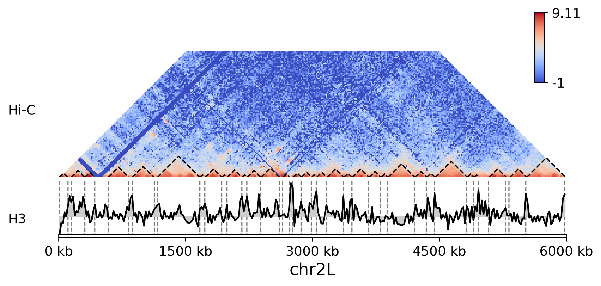

Example usage
=============

Optimization mode
------------------
First, execute `test_data.sh` script, included in optimalTAD folder:

.. code:: bash

	chmod a+x ./test_data.sh
	./test_data.sh

It will create `testdata` folder containing Hi-C and ChIP-seq profiles of Drosophila chromosome 2L. Next, run optimalTAD as follows:

.. code:: bash

	optimalTAD run

If everything done in a correct way, than you will see something like this in your terminal:

.. code-block:: INI

	optimalTAD: INFO       Samplename: LacZ1_2L
	optimalTAD: INFO       Load Hi-C data
	optimalTAD: INFO       Load epigenetic data
	numexpr.utils: INFO       NumExpr defaulting to 4 threads.
	optimalTAD: INFO       Run armatus on 1 chromosomes:
	                      |███████████████████████████████████████████████| 100.0% complete
	optimalTAD: INFO       Calculate indexes
	optimalTAD: INFO       Calculate amplitudes
	optimalTAD: INFO       The optimal gamma for LacZ1_2L is 1.1
	optimalTAD: INFO       Done!

	optimalTAD: INFO       Execution time: 26.6 sec

This output tells us that the optimal set of TADs is corresponded to `gamma` = 1.1

Once optimization is done, we can explore the folder named 'output' containing all the results along with temporary files generated by optimalTAD. The output directory has a following structure:

.. code-block:: INI

	├── all_stairs.csv
	├── amplitudes.csv
	├── data
	│	└── LacZ1_2L
	│		└── chr2L.txt.gz
	├── figures
	│	├── BestStairs.png
	│	└── StairAmplitude.png
	├── optimal_gamma
	│	└── LacZ1_2L
	│		└── domains.tad
	├── stair.csv
	└── tads
	    └── LacZ1_2L
	        └── chr2L

- all_stairs.csv: distributions of the ChIP-seq profile around TAD boundaries for each 'gamma' value
- stair.csv: distribution of the ChIP-seq profile around TAD boundaries for each 'gamma' value
- chr2L.txt.gz: contact matrix of the input 2L chromosome, temporary file
- domains.tad: TAD set corresponded to optimal 'gamma' parameter
- tads: multicale TAD sets for each 'gamma' predicted by Armatus

Algorithm also generates two figures, `BestStairs.png` ('a' subpanel in the figure below) and `StairAmplitude.png` ('b' subpanel). 

Visualization mode
------------------

To plot Hi-C matrix along with optimal TAD set and ChIP-seq profiles, run code below:

.. code:: bash

	optimalTAD visualize

